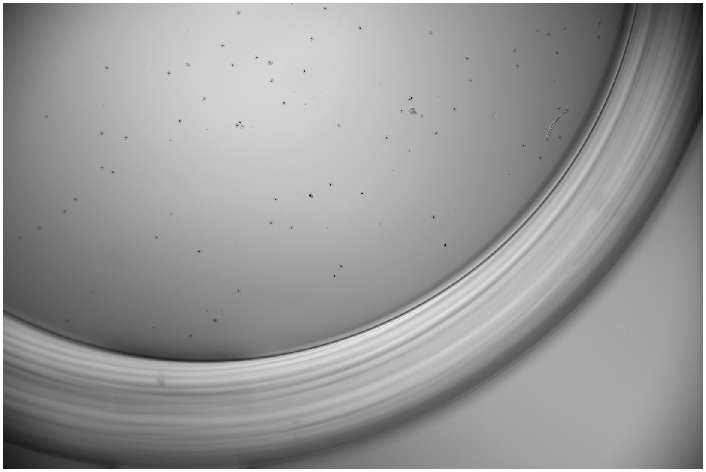
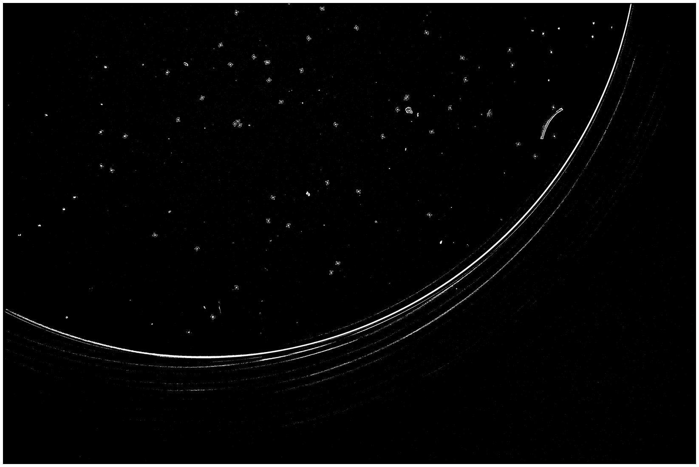
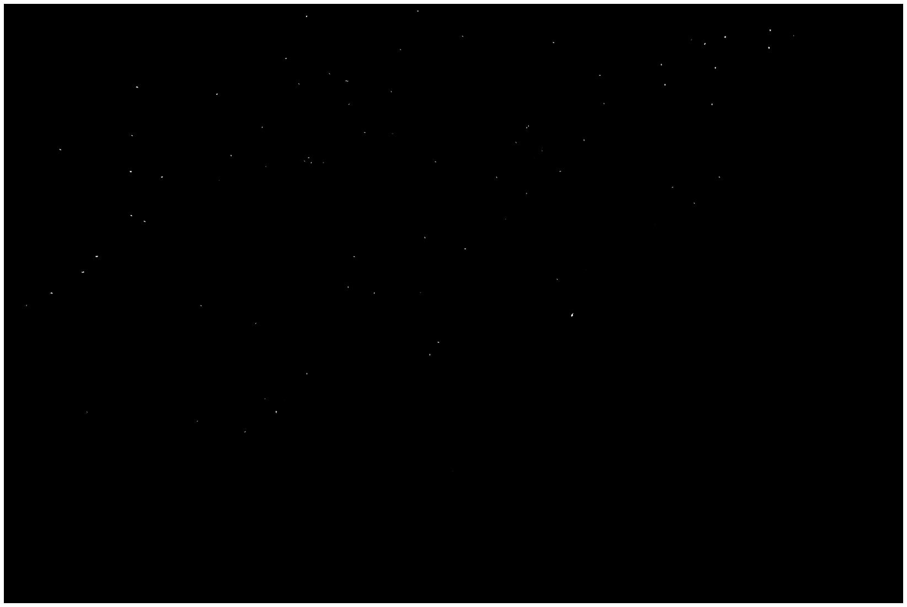
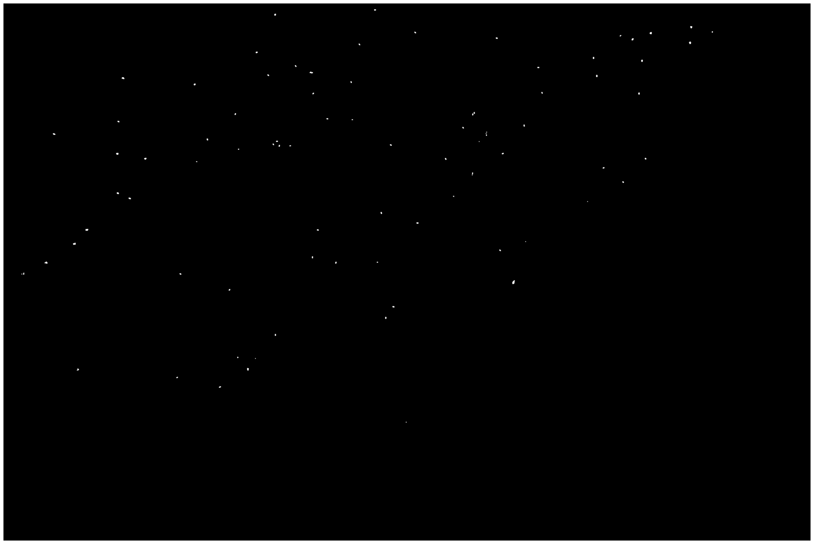

# ImageProcessing_HW1_BarcodeBeadsDetection
NCKU 110-1 影像處理與機器人視覺：基礎與設計 作業1

## 環境
- python v3.9 [網站](https://pipenv-fork.readthedocs.io/en/latest/)
- pipenv 套件管理工具 [網站](https://pipenv-fork.readthedocs.io/en/latest/) 

## 使用說明
1. 下載專案
2. 移至專案目錄\
`cd /d ImageProcessing_HW1_BarcodeBeadsDetection`
2. 安裝所需套件\
`pipenv install`

## 功能實現

### 捲積 Convolution
#### 程式碼
```python
def conv(img: np.ndarray, kernal: np.ndarray, pad_value = 0) -> np.ndarray:

    # pad
    padSize = numpy.array(kernal.shape) // 2
    # 宣告新陣列
    paddedImg = numpy.ones([img.shape[0] + padSize[0]*2, img.shape[1] + padSize[1]*2]) * pad_value
    # 將原陣列複製至新陣列中央
    paddedImg[padSize[0]:-padSize[0], padSize[1]:-padSize[1]] = img
    
    # conv windows
    view_shape = tuple(np.subtract(paddedImg.shape, kernal.shape) + 1) + kernal.shape
    strides = paddedImg.strides + paddedImg.strides
    sub_matrices = np.lib.stride_tricks.as_strided(paddedImg, view_shape, strides)
    
    # for-loop method
    n = np.zeros(sub_matrices.shape[:2])
    for i in range(sub_matrices.shape[0]):
        for j in range(sub_matrices.shape[1]):
            n[i, j] = np.sum(np.multiply(sub_matrices[i, j, :, :], y))
    
    return n
```
#### 參數介紹
- `x` 為輸入的二維影像
- `y` 為kernal
- `pad_value` 為四周補值時使用的數值

#### 說明
- `Padding`
    1. 宣告一個`圖片大小 + (捲積核大小-1)/2`的陣列，並填入填充值
    2. 將原圖片填入新陣列的中央即完成
- `Kernal Windows`

- `Convolution`

### Erosion
#### 程式碼
```python
def erosion(img: numpy.ndarray, kernal: numpy.ndarray):
    m, n = kernal.shape

    result = conv(img, kernal, 0).astype(numpy.uint8)

    result[result < m*n] = 0
    result[result >= m*n] = 1

    return res
```
#### 說明

### Dilation
#### 程式碼
```python
def dilation(img: numpy.ndarray, kernal: numpy.ndarray):
    m, n = kernal.shape

    img_inv = numpy.logical_not(img)

    result = conv(img_inv, kernal, 1).astype(numpy.uint8)
    result[result < m*n] = 1
    result[result >= m*n] = 0

    return result
```
#### 說明

### Connected Component Labeling
#### 程式碼
```python
def connectedComponents(img: np.ndarray):
    assert len(img.shape) == 2

    padImg = np.zeros([img.shape[0] + 1 * 2, img.shape[1] + 1 * 2], dtype=bool)
    padImg[1:-1, 1:-1] = img.astype(bool)

    # 
    connectedLabel = [0]
    mask = np.zeros_like(padImg, dtype=np.int32)
    for i in range(1, padImg.shape[0], 1):
        for j in range(1, padImg.shape[1], 1):
            if not padImg[i, j]:
                continue
            
            upper = mask[i-1, j]
            lefter = mask[i, j-1]

            if upper and (not lefter):
                mask[i, j] = upper
            elif (not upper) and lefter:
                mask[i, j] = lefter
            elif upper and lefter:
                mask[i, j] = upper
                connectedLabel[lefter] = upper
            elif (not upper) and (not lefter):
                mask[i, j] = len(connectedLabel)
                connectedLabel.append(len(connectedLabel))

    # 
    for n in range(1, len(connectedLabel)):
        c = n
        while c != connectedLabel[c]:
            c = connectedLabel[c]

        mask[mask == n] = c

    return mask[1:-1, 1:-1]
```
#### 說明


## 處理步驟說明
### Step 1 : Gray Scale


### Step 2 : Adaptive Threshold


### Step 3 : Erosion


### Step 4 : Dilation


### Step 5 : Connected Component Labeling filter


### Step 6 : Reverse Color


## 結果
### 樣張 1


---
### 樣張 2


---
### 樣張 3


