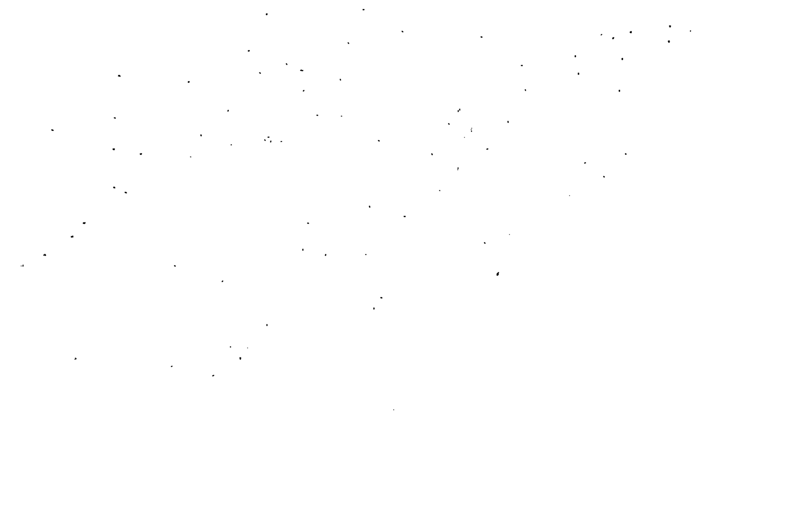

# ImageProcessing_HW1_BarcodeBeadsDetection
NCKU 110-1 影像處理與機器人視覺：基礎與設計 作業1


## 環境
- python v3.9 [網站](https://pipenv-fork.readthedocs.io/en/latest/)
- pipenv 套件管理工具 [網站](https://pipenv-fork.readthedocs.io/en/latest/) 

## 使用說明
1. 下載專案
2. 移至專案目錄\
`cd /d ImageProcessing_HW1_BarcodeBeadsDetection`
2. 安裝所需套件\
`pipenv install`

## 功能實現

### 捲積 Convolution
#### 程式碼
```python
def convWithPadding(img: np.ndarray, kernal: np.ndarray, pad_value = 0) -> np.ndarray:

    # pad
    padSize = numpy.array(kernal.shape) // 2
    # define new array for padded image
    paddedImg = numpy.ones([img.shape[0] + padSize[0]*2, img.shape[1] + padSize[1]*2]) * pad_value
    # copy origin image to the new array with offset 
    paddedImg[padSize[0]:-padSize[0], padSize[1]:-padSize[1]] = img
    
    # conv windows
    view_shape = tuple(np.subtract(paddedImg.shape, kernal.shape) + 1) + kernal.shape
    strides = paddedImg.strides + paddedImg.strides
    sub_matrices = np.lib.stride_tricks.as_strided(paddedImg, view_shape, strides)
    
    # for-loop method
    n = np.zeros(sub_matrices.shape[:2])
    for i in range(sub_matrices.shape[0]):
        for j in range(sub_matrices.shape[1]):
            n[i, j] = np.sum(np.multiply(sub_matrices[i, j, :, :], y))
    
    return n
```
#### 參數介紹
- `x` 為輸入的二維影像
- `y` 為kernal
- `pad_value` 為四周補值時使用的數值

#### 說明
- `Padding`  
將圖片的4邊補上指定數值，以確保捲積運算後得到的陣列大小與原陣列大小一致
    1. 宣告一個`圖片大小 + (捲積核大小-1)/2`的陣列，並填入數值
    2. 將原圖片填入新陣列的中央即完成
- `Kernal Windows`  
將原始影像切割為一個一個和捲積核一樣大小的小陣列以方便後續的矩陣運算
- `Convolution`  
使用迴圈進行捲積運算
    1. 將每個小矩陣取出
    2. 與捲積核進行元素相乘
    3. 計算總和

### Erosion
#### 程式碼
```python
def erosion(img: numpy.ndarray, kernal: numpy.ndarray):
    m, n = kernal.shape

    # convolution
    result = convWithPadding(img, kernal, 0).astype(numpy.uint8)

    # thresholding for eroded mask
    result[result < m*n] = 0
    result[result >= m*n] = 1

    return res
```
#### 說明
1. 對遮罩做捲積運算
2. 判斷數值是否為捲積核的總和 (**捲積核必須為完整的矩形**)
3. 若為總和則填入1，否則填入0

### Dilation
#### 程式碼
```python
def dilation(img: numpy.ndarray, kernal: numpy.ndarray):
    m, n = kernal.shape

    # create inverse mask of input
    img_inv = numpy.logical_not(img).astype(numpy.int32) * 1

    # run erosion over inverse mask
    result_erosion = convWithPadding(img_inv, kernal, 1)
    result_erosion[result_erosion < m*n] = 0
    result_erosion[result_erosion >= m*n] = 1

    # inverse mask again
    result = numpy.logical_not(result_erosion).astype(numpy.uint8) * 1

    return result
```
#### 說明
相當於前後景反轉後執行erosion運算後再次反轉
1. 將遮罩前後景反轉
2. 對遮罩做捲積運算 (**捲積核必須為完整的矩形**)
3. 若為總和則填入0，否則填入1

### Adaptive Thresholding
#### 程式碼
```python
def adaptiveThreshold(x:numpy.ndarray, kernalSize=3, offset = -5):
    sigma = 0.3 * ((kernalSize - 1) * 0.5 - 1) + 0.8
    guass_kernal = get_guassKernal(l=kernalSize, sig=sigma)
    threshold = convWithPadding(x, guass_kernal, 0) + offset

    res = numpy.zeros(x.shape, dtype=numpy.uint8)
    res[x < threshold] = 1

    return res
```
#### 說明
使用高斯核對圖片進行卷積運算來取得局部範圍的加權平均，並以此數值作為二值化的閥值


### Connected Component Labeling
#### 程式碼
```python
def connectedComponents(img: np.ndarray):
    assert len(img.shape) == 2

    padImg = np.zeros([img.shape[0] + 1 * 2, img.shape[1] + 1 * 2], dtype=bool)
    padImg[1:-1, 1:-1] = img.astype(bool)

    # 
    connectedLabel = [0]
    mask = np.zeros_like(padImg, dtype=np.int32)
    for i in range(1, padImg.shape[0], 1):
        for j in range(1, padImg.shape[1], 1):
            if not padImg[i, j]:
                continue
            
            upper = mask[i-1, j]
            lefter = mask[i, j-1]

            if upper and (not lefter):
                mask[i, j] = upper
            elif (not upper) and lefter:
                mask[i, j] = lefter
            elif upper and lefter:
                mask[i, j] = upper
                connectedLabel[lefter] = upper
            elif (not upper) and (not lefter):
                mask[i, j] = len(connectedLabel)
                connectedLabel.append(len(connectedLabel))

    # 
    for n in range(1, len(connectedLabel)):
        c = n
        while c != connectedLabel[c]:
            c = connectedLabel[c]

        mask[mask == n] = c

    return mask[1:-1, 1:-1]
```
#### 說明
連通區域標記(CCL)分為2個步驟，包含**尋找與標記相連的像素點**與**組合相連的標記**
1. 尋找與標記相連的像素點  
遍歷所有非零像素點，並判斷其上下左右4個位置的像素點與中心點的關係
    - 若其四周皆為零則新增一標號給該點
    - 若四周有非零的點則標號跟隨該點
    - 若四周有超過2種非零點則將2種標號標記為連通

2. 組合相連的標記  
將步驟1之中標記為連通的標號重新編號，確保互相連通的部分為同一標號


## 處理步驟說明
### Step 1 : Gray Scale
將圖片由RGB轉換為灰階影像


### Step 2 : Adaptive Threshold
使用局部加權平均來將圖片二值化


### Step 3 : Mask
使用Connected Components Labeling方法分別由經過2種不同erosion和dilation組合的圖片衷選出雜點\
- **mask 1**  選出水漬


- **mask 2**  選出大型雜點


- **result**  套用上面2種遮罩


### Step 3 : Erosion
使用5*5的卷積核對選取到的部分(白色)進行形態學中的侵蝕操作


### Step 4 : Dilation
使用5*5的卷積核對選取到的部分(白色)進行形態學中的膨脹操作


### Step 6 : Reverse Color
根據要求將圖片的前後景反轉


## 結果
### 樣張 1


---
### 樣張 2


---
### 樣張 3


---
### 樣張 4


---
### 樣張 5


---
### 樣張 6


